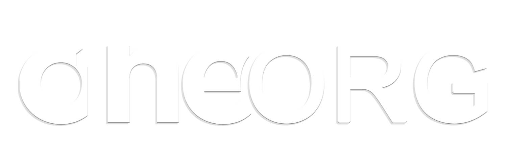

# ONEORG Project

## Revolutionizing the Future

### Project Codename: Genesis | NXFinity

Welcome to the ONEORG project! Developed by Lee Services & Solutions LLC, our groundbreaking initiative, codenamed Genesis | NXFinity, is poised to revolutionize the industry. Our mission is to bridge the gap between industries and reshape the way they work together.

With our cutting-edge technology and innovative solutions, we are at the forefront of the industry, offering a comprehensive suite of services and solutions through our BaaS (Business-as-a-Service) and SaaS (Software-as-a-Service) platforms. Our goal is to close the gap between industries and provide seamless integration, enabling businesses to thrive in the digital era.

Join us on this exciting journey as we shape the future of industries. Together, we can unlock limitless possibilities and unleash the true potential of collaboration and innovation.



# Document List

Below is a list of documents available in our project:

All our docs can be found in the `./docs` folder.

- [Index](./docs/index.md):
  - [Introduction](./docs/introduction.md)
  - [Getting Started](./docs/getting_started/getting_started.md)

Feel free to explore these documents to learn more about our project and get started with using our software.

```bash
npm run start:hads
```
Will run the documentation locally on port 4040 and open automatically.
